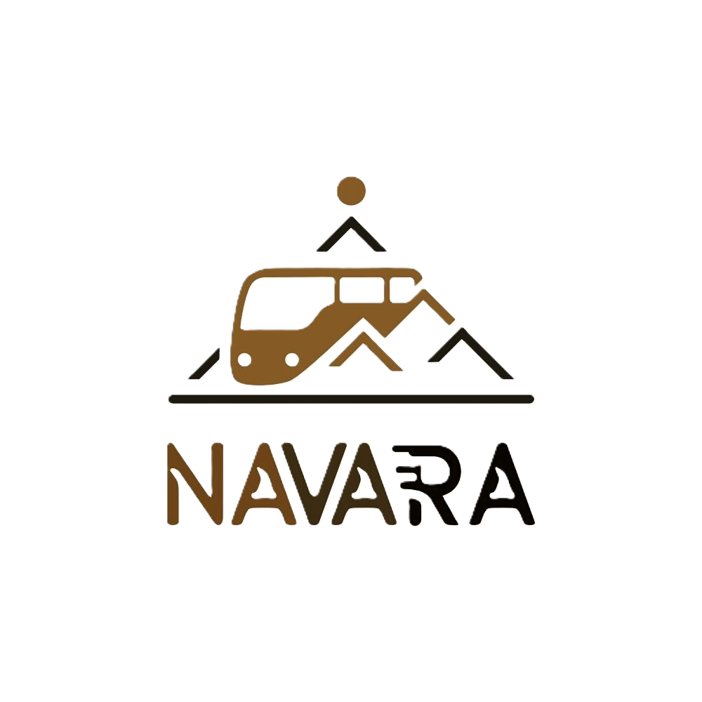

<div align="center">
  
  
  # 🚌 Navara Trans
  **Premium Bus Charter & Tourism Services**

[](https://reactjs.org/)
[](https://vitejs.dev/)
[](https://tailwindcss.com/)
[](https://www.framer.com/motion/)

  <p align="center">
    <b>Modern. Elegant. Responsive.</b><br />
    Platform web premium untuk layanan transportasi dan pariwisata, dibangun dengan estetika <i>Glassmorphism</i> dan animasi interaktif.
  </p>
</div>

---

## 📖 Tentang Project

**Navara Trans** adalah website modern yang dirancang untuk memberikan pengalaman _booking_ transportasi yang seamless dan eksklusif. Website ini fokus pada:

- **Visual Storytelling**: Menggunakan tipografi besar, gambar berkualitas tinggi, dan animasi scroll (AOS/Framer Motion).
- **Interaktivitas**: Hover effects, paralaks, dan transisi halaman yang halus.
- **Informasi Terstruktur**: Katalog armada dan paket wisata yang mudah dijelajahi.

## ✨ Fitur Unggulan

- **💎 Aesthetic UI**
  Mengusung gaya _Clean Luxury_ dengan elemen kaca (glassmorphism), gradasi warna brand (Red & Black), dan _whitespace_ yang lega.
- **📱 Fully Responsive**
  Tampilan mobile-first yang dimaksimalkan. Filter armada menggunakan _horizontal scroll_ yang intuitif di layar kecil, dan menu navigasi yang adaptif.

- **🎬 Advanced Animations**

  - **Hero Fade-Up**: Judul dan elemen penting muncul secara elegan saat dimuat.
  - **Staggered Grid**: Kartu layanan dan paket wisata muncul berurutan.
  - **Interactive Cards**: Efek _lift_ dan _glow_ saat kursor melayang di atas elemen.

- **🚌 Fleet & Services Showcase**
  Katalog armada (Bus, Hiace) dan layanan korporat yang detail dengan visualisasi data yang menarik.

---

## 📸 Galeri Tampilan

Berikut adalah cuplikan antarmuka terbaru dari Navara Trans:

<div align="center">
  <table>
    <tr>
      <td align="center">
        <b>Hero & Landing Page</b><br/>
        
      </td>
      <td align="center">
        <b>Service Animations</b><br/>
        
      </td>
    </tr>
    <tr>
      <td align="center">
        <b>Fleet Catalog</b><br/>
        
      </td>
      <td align="center">
        <b>Mobile Experience</b><br/>
        
      </td>
    </tr>
     <tr>
      <td align="center">
        <b>Booking Widget</b><br/>
        
      </td>
      <td align="center">
        <b>Detail & Typography</b><br/>
        
      </td>
    </tr>
  </table>
</div>

---

## 🛠️ Tech Stack

Project ini dibangun dengan ekosistem JavaScript modern untuk performa maksimal:

| Kategori               | Teknologi     | Deskripsi                                       |
| :--------------------- | :------------ | :---------------------------------------------- |
| **Frontend Framework** | React 18      | Component-based UI architecturel.               |
| **Build Tool**         | Vite          | _Lightning fast_ HMR & bundling.                |
| **Styling**            | Tailwind CSS  | Utility-first CSS framework.                    |
| **Animation**          | Framer Motion | Library animasi _production-ready_ untuk React. |
| **Icons**              | Lucide React  | Ikon modern, ringan, dan konsisten.             |
| **Routing**            | React Router  | Navigasi SPA (Single Page Application).         |

---

## 🚀 Cara Instalasi

Ikuti langkah ini untuk menjalankan project di komputer Anda:

1.  **Clone Repository**

    ```bash
    git clone https://github.com/username/navara-trans.git
    cd navara-trans
    ```

2.  **Install Dependencies**
    Pastikan Node.js sudah terinstall.

    ```bash
    npm install
    ```

3.  **Jalankan Mode Dev**

    ```bash
    npm run dev
    ```

    Akses via browser di: `http://localhost:5173`

4.  **Build untuk Produksi**
    ```bash
    npm run build
    ```

---

## 🤝 Kontribusi & Lisensi

Dibuat dengan ❤️ untuk **Navara Trans**.

Jika Anda menemukan bug atau ingin request fitur, silakan buat _issue_ di repository ini.
Lisensi: **MIT**.
