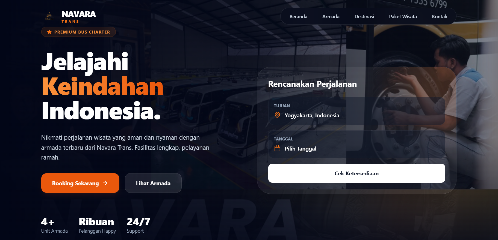
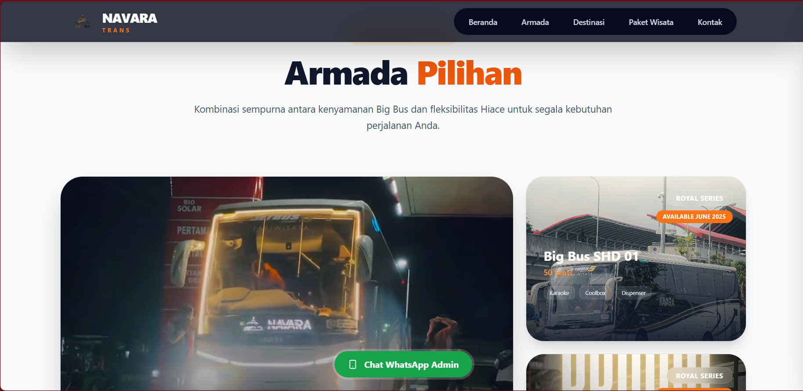
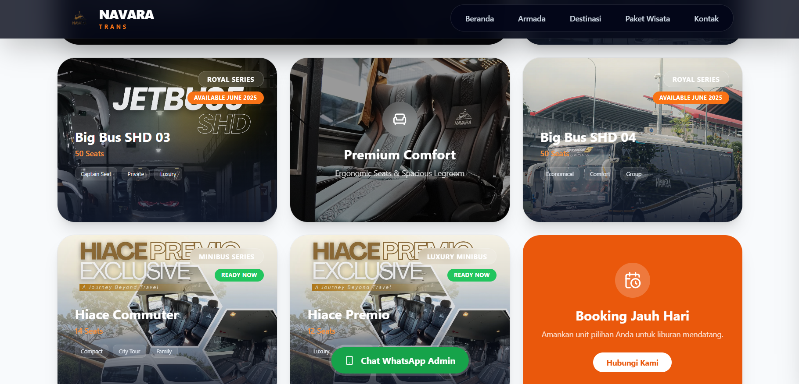
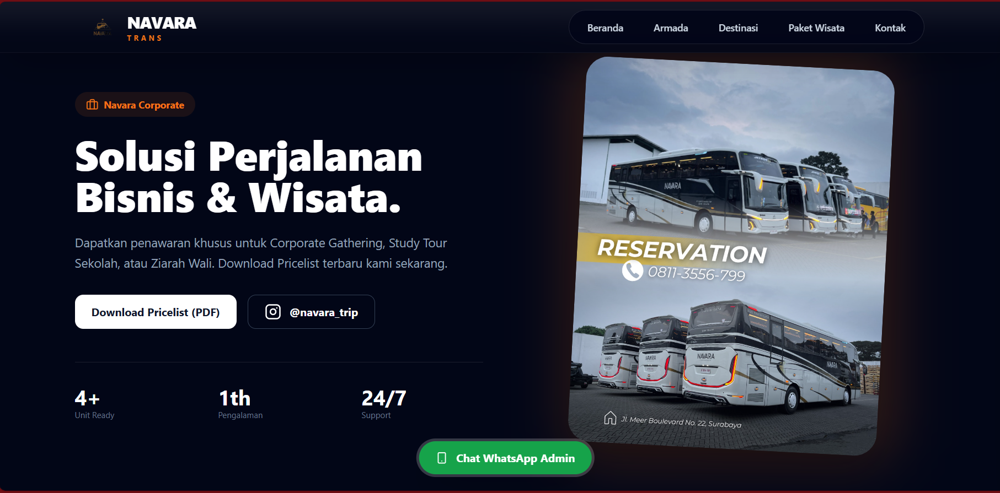

# 🚌 Navara Trans - Premium Bus Charter & Tourism


**Navara Trans** adalah platform web modern dan responsif yang dirancang untuk layanan penyewaan bus pariwisata dan paket wisata premium. Dibangun dengan teknologi web terkini untuk memberikan pengalaman pengguna yang cepat, elegan, dan informatif.

---

## ✨ Fitur Utama

*   **🎨 Desain Modern & Premium**: Menggunakan gaya *Glassmorphism* dan tipografi modern (Outfit) untuk kesan mewah.
*   **📱 Responsif Mobile-First**: Tampilan yang optimal di semua perangkat, dari smartphone hingga desktop layar lebar.
*   **🚌 Galeri Armada Dinamis**: Menampilkan detail armada (Big Bus, Hiace) dengan status ketersediaan yang jelas.
*   **📅 Widget Booking Interaktif**: Memudahkan pengguna untuk memilih jenis layanan (Charter/Tour) dan memulai pemesanan.
*   **📍 Destinasi & Paket Wisata**: Informasi visual yang menarik tentang tujuan wisata populer.
*   **📞 Integrasi Kontak Langsung**: Tombol WhatsApp dan telepon yang terintegrasi untuk konversi cepat.

---

## 📸 Galeri Aplikasi

Berikut adalah tampilan antarmuka dari website Navara Trans:

### Halaman Utama (Hero Section)
Tampilan awal yang memukau dengan navigasi transparan dan widget booking yang elegan.


### Pilihan Armada (Fleet)
Katalog armada yang lengkap dengan informasi kapasitas dan fasilitas.



### Informasi & Reservasi
Bagian promo dan informasi layanan pelanggan yang informatif.


---

## 🛠️ Teknologi yang Digunakan

Project ini dibangun menggunakan stack teknologi modern:

*   **[React](https://reactjs.org/)**: Library JavaScript untuk membangun antarmuka pengguna.
*   **[Vite](https://vitejs.dev/)**: Build tool yang super cepat untuk pengembangan frontend modern.
*   **[Tailwind CSS](https://tailwindcss.com/)**: Framework CSS utility-first untuk styling yang cepat dan fleksibel.
*   **[Lucide React](https://lucide.dev/)**: Koleksi ikon yang ringan dan konsisten.
*   **[Swiper](https://swiperjs.com/)**: Library slider sentuh modern (jika digunakan untuk carousel).

---

## 🚀 Cara Menjalankan Project

Ikuti langkah-langkah berikut untuk menjalankan project ini di komputer lokal Anda:

1.  **Clone Repository**
    ```bash
    git clone https://github.com/username/navara-trans.git
    cd navara-trans
    ```

2.  **Install Dependencies**
    Pastikan Anda sudah menginstall [Node.js](https://nodejs.org/).
    ```bash
    npm install
    ```

3.  **Jalankan Development Server**
    ```bash
    npm run dev
    ```
    Buka browser dan akses `http://localhost:5173`.

4.  **Build untuk Produksi**
    ```bash
    npm run build
    ```

---

## 📄 Lisensi

Project ini dilisensikan di bawah [MIT License](LICENSE).

---

<p align="center">
  Dibuat dengan ❤️ oleh Tim Pengembang Navara Trans
</p>
